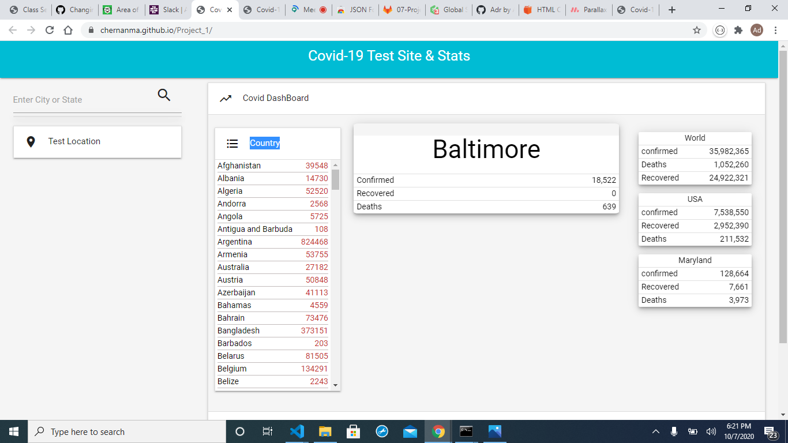
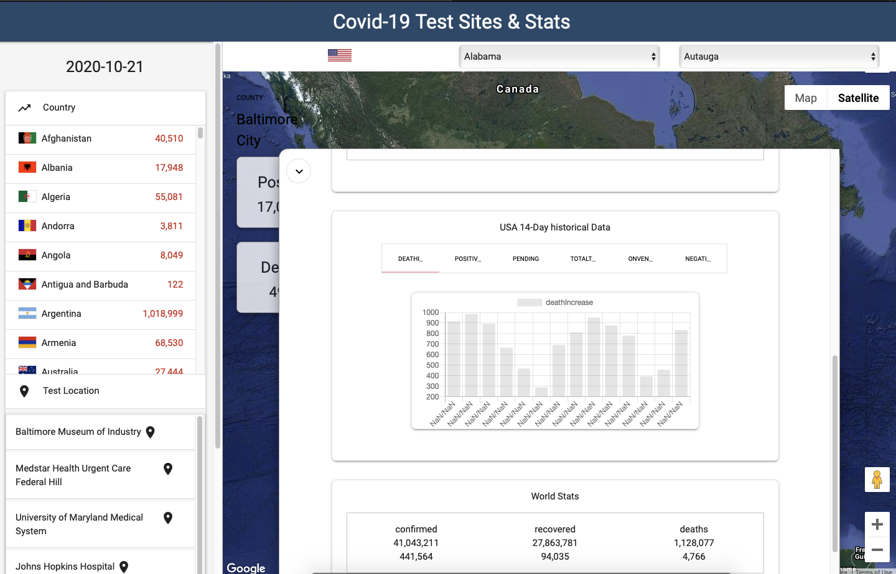

# Covid-19 Test Sites & Stats

This Covid tracker application delivers the current covid19 updates and statistics nationwide. The User can search for any city and view instantaneous status and trends pertaining to the Coronavirus disease.

[Click here to go to Covid-19 Stats Site](https://chernanma.github.io/Project_1/)



### Table of Contents
- [Description](#description)
- [How to Use](#how-to-use)
- [Screenshots](#screenshots)
- [References](#references)
- [Author Info](#author-info)
---
## Description
 
The purpose of this project is to create a web page that enables users to gather critical information, aid, and assist the general public with awareness as we are all faced with these unprecedented circumstances of a global pandemic.

##### Technologies

- Html
- jQuery
- Visual Studio Code
- Materialized Framework
- APIs
    - CORS Solution - https://cors-anywhere.herokuapp.com/
    - COVID-19 Testing Sites Location API - https://developer.here.com/blog/finding-covid-19-testing-sites
    - County Name  - https://maps.googleapis.com/maps/api/place/autocomplete/json?
    - Google Maps API - https://developers.google.com/maps/documentation/embed
    - Google Places API - https://maps.googleapis.com/maps/api/place/autocomplete/json?
    - COVID-19 Information and Stats API - https://covid-api.com/api/
    - COVID-19 Information and Stats API - https://api.covid19tracking.narrativa.com/api/


##### Code sample - AJAX to get usa historical data from the API


```js
 /** */
function getUsaHistoricalData (){
    // ajax request
    $.ajax({
        url: 'https://api.covidtracking.com/v1/us/daily.json',
        method: 'GET'
    }).then(function(response) {

        console.log(response);

        let data = [];
        for(let i = 0; i < 14; i ++){
            let currentData = response[i];
            let tempObj = {};
            cDate = currentData.date.toString();
            // date
            tempObj['date'] = `${cDate.substring(0,4)},${cDate.substring(4,6)},${cDate.substring(6,8)}`;
            // death
            tempObj['deathIncrease'] = currentData.deathIncrease;
            // hospitalized
            tempObj['hospitalizedIncrease'] = currentData.hospitalizedIncrease;
            // on ventilator
            tempObj['onVentilatorCurrently'] = currentData.onVentilatorCurrently
            // positiveIncrease
            tempObj['positiveIncrease'] = currentData.positiveIncrease;
            // negativeIncrease
            tempObj['negativeIncrease'] = currentData.negativeIncrease;
            // recovered
            tempObj['recovered'] = currentData.recovered;
            // total test Results
            tempObj['totalTestResultsIncrease'] = currentData.totalTestResultsIncrease;
            // pending
            tempObj['pending'] = currentData.pending;
            
            if(i === 0) {
                // latest data for usa
                // usaData(tempObj);
            }
            data.push(tempObj);
        }
        console.log(data);
        usaHistoricalData(data);
    });
}
```
[Back To The Top](#Covid-19-Test-Sites-&-stats)
---
## How To Use

 The User will enter a specific location which will display all nearby testing locations for Covid-19 in that area. Users can also view directions and testing sites via map and gps intergrated by developers. The current statistics can also be displayed with a "click of the finger function", that captures current analytical data and trends provided by API's. 

## Screenshots

- Search Input

- Statistics Tab 

- Map Tab


[Back To The Top](#Covid-19-Test-Sites-&-stats)
---
## References
- w3school -- [jQuery Tutorial](https://www.w3schools.com/jquery/)
- Bootstrap -- [Build fast, responsive sites with Bootstrap](https://getbootstrap.com/)
- W3school -- [The HTML DOM Element Object](https://www.w3schools.com/jsref/dom_obj_all.asp)

- W3school -- [AJAX Introduction](https://www.w3schools.com/js/js_ajax_intro.asp)


[Back To The Top](#Covid-19-Test-Sites-&-stats)
---
## License
Copyright (c) [2020] International Team

[Back To The Top](#Covid-19-Test-Sites-&-stats)
---
## Author Info
- Linkedin -- [Cesar Martinez](https://www.linkedin.com/in/cesar-martinez-3986b3120/)
- Linkedin -- [Adrian Storr](https://www.linkedin.com/in/adrian-storr-98773731)
- Linkedin -- [Amit Karmacharya](https://www.linkedin.com/in/amit-karmacharya-b344731ab/)
- Linkedin -- [Prashant Gurung](https://www.linkedin.com/in/prashant-gurung-563621119/)

[Back To The Top](#Covid-19-Test-Sites-&-stats)
